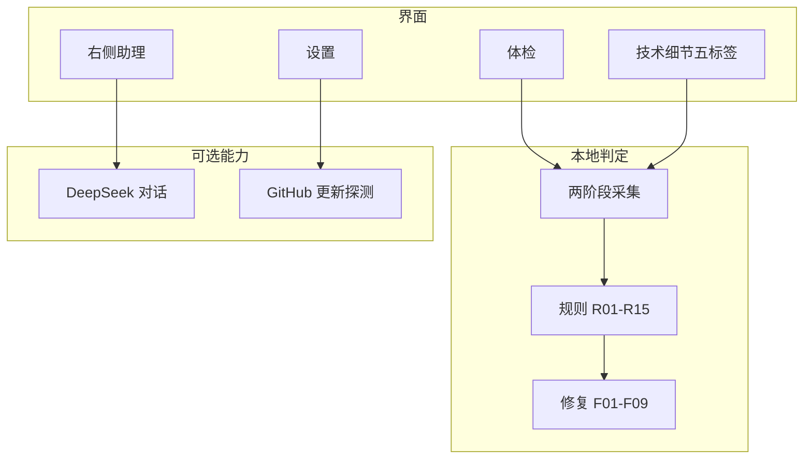
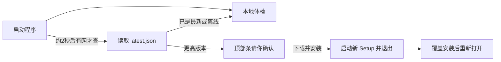
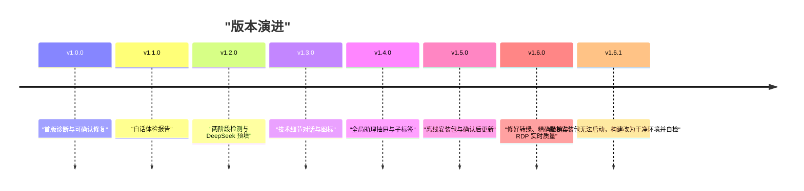

# 远程桌面连接优化器

Windows 桌面工具：实时看清 Tailscale 是否被 v2rayN Tun 劫持、节点是直连还是走海外 DERP，并给出可确认执行、可回滚的修复动作。

当前版本：`1.6.1`

开源仓库：<https://github.com/cr20085361/Remote-Desktop-Connection-Optimizer>

## 架构一眼清



## 启动与更新



安装包本身不访问网络，U 盘拷过去也能装。有网时才会向 GitHub Release 探测；**点确认后才会下载**。

## 迭代一眼清



## 离线安装包

从 [Releases](https://github.com/cr20085361/Remote-Desktop-Connection-Optimizer/releases/latest) 下载：

- `RdpOptimizer-Setup-<版本>.exe`：离线安装包（快捷方式、程序和功能、窗口标题均为 `远程桌面连接优化器 <版本>`）
- `latest.json`：版本、文件名、SHA256，供程序检查更新

本机构建：

```powershell
powershell -ExecutionPolicy Bypass -File .\scripts\build-release.ps1
```

脚本会在 `.venv-build` 干净虚拟环境里打包，并在出安装包前自动跑一次冻结程序自检（`RdpOptimizer.exe --selftest`）。产出在 `dist\RdpOptimizer\`（便携目录）和 `dist\installer\RdpOptimizer-Setup-<版本>.exe`（需已安装 [Inno Setup 6](https://jrsoftware.org/isinfo.php)）。

安装目录固定为 `C:\Program Files\远程桌面连接优化器`（不含版本号，便于覆盖升级）。旧版带版本号的快捷方式会在新安装时清掉。

程序启动约 2 秒后检查更新（可在设置关掉）。发现新版本时顶部出现横幅，点「下载并安装」才会拉取 Setup 并校验哈希。设置页也可手动「检查更新」。

补发 GitHub Release（已登录 `gh` 时）：

```powershell
gh release create v1.6.1 dist\installer\RdpOptimizer-Setup-1.6.1.exe dist\latest.json --title "远程桌面连接优化器 1.6.1" --notes "见 Release 说明。"
```

## 它解决什么

异地 Windows 机器用同一个 Tailscale 账号组网，同时装着 v2rayN。远程桌面卡顿时，常见原因不是“带宽不够”，而是：

1. **Tun 把 Tailscale 的 STUN/WireGuard UDP 送进了国外代理节点**，端点探测地址变成代理出口 IP。
2. 最近 DERP 被判定为洛杉矶等地，延迟 600ms+，直连失败后 RDP 几乎不可用。
3. 系统代理绕过列表没有 `100.*`，或 RDP 被关掉 UDP。

本工具用本地规则 R01–R15 判定上述问题，不依赖云端模型。DeepSeek / Qwen 只是可选顾问。

## 环境

- Windows 10/11
- Python 3.11+
- 本机已安装 Tailscale CLI（`C:\Program Files\Tailscale\tailscale.exe`）
- 建议以**管理员**运行（修复注册表、接口跃点需要）

```powershell
cd <项目目录>
python -m pip install -r requirements.txt
python main.py
```

命令行诊断（不打开窗口）：

```powershell
python main.py --cli diagnose
python main.py --cli diagnose --json
python main.py --cli fixes
```

## 界面

打开后是一份「体检报告」，不需要懂网络术语：

- **体检**：健康评分、一句话结论、白话问题卡片。每张卡片说明「发生了什么 / 对你的影响 / 下一步」，并带「修复这个」和「问 AI」。
- **技术细节**：五个子标签一次只看一块——关系图、延迟曲线、远程桌面（当前会话走 UDP 还是 TCP、延迟、丢包）、问题记录、撤销。问题记录选中一条后可「问 AI」。
- **右侧助理**：全局抽屉，体检和技术细节都能用，可收成竖条。对话按 Markdown 显示，长回复能滚完。
- **设置**：检测周期、v2rayN 路径、对端快照端口/共享令牌（可粘贴对端令牌或生成新令牌）、启动时检查更新。DeepSeek 接口地址已按官网预填，只需粘贴 API Key 并选择 `deepseek-flash` 或 `deepseek-v4-pro`。

点「修复这个」会先说明会改什么、能否撤销。若需要你去 v2rayN 重启 Tun，顶部会出现一条提示，做完点「我已完成，重新检测」，会弹出处理前后的对比。

检测时结论卡会显示步骤进度（例如 3/8）；名单、出路、翻墙、远程桌面会先出结果，中转站位置和延迟随后补上。

## DeepSeek 接入

按 [DeepSeek API 文档](https://api-docs.deepseek.com/) 预填：

| 项 | 值 |
| --- | --- |
| Base URL | `https://api.deepseek.com` |
| 对话接口 | `POST /chat/completions` |
| 推荐模型 | `deepseek-flash`（DeepSeek-V4.1-Flash） |
| 更强模型 | `deepseek-v4-pro`（DeepSeek-V4-Pro-0813） |
| 兼容别名 | `deepseek-v4-flash`、`deepseek-v4-flash-vision-exp`（转发到 Flash） |

旧名 `deepseek-chat` / `deepseek-reasoner` 已停用，程序会自动改到 `deepseek-flash`。API Key 只存在 Windows 凭据管理器，不会写入设置文件。设置页可点「测试连接」确认密钥有效。右侧助理会把回复按 Markdown 流式打出来，用来确认模型正在工作。助手身份是本软件接入的 DeepSeek，不会自称其他模型。

## 双端可见性

每台机器启动后会在 **Tailscale 地址** 上监听 `18765`：

`http://<100.x.x.x>:18765/snapshot?token=<共享令牌>`

把同一套程序装到家里/办公室电脑，并在两边的「设置 → 共享令牌」填同一个值（一边点「生成新令牌」并复制，另一边粘贴）后，主控机拓扑图能显示对端出口 IP、DERP、Tun 状态，从而判断卡顿发生在哪一侧。

## 本地规则与修复

| 规则 | 含义 | 修复 |
| --- | --- | --- |
| R01 | 代理隧道劫持 Tailscale 端点 | F01 / F02 / F04 |
| R02 | DERP 落在高延迟海外区 | F01 / F02 |
| R03 | 节点走 DERP 而非直连 | F01 / F09 |
| R04 | 直连但 RTT > 120ms | F01 / F04 |
| R05 | Tun 抢占默认路由 | F01 / F02 / F05 |
| R06 | ProxyOverride 缺 `100.*` | F03 |
| R07 | RDP 传输层异常 | F06 |
| R08 | MTU / PMTU 不匹配 | F07 |
| R09 | 抖动或丢包 | F01 / F08 |
| R10 | 当前走 Wi-Fi | F08 |
| R11 | 活动 RDP 建议用优化配置 | F08 |
| R12 | Tailscale 未运行 / 未登录 / 已断开 | 手动 |
| R13 | 本机正在使用 Tailscale 出口节点 | 手动 |
| R14 | 远程桌面只走 TCP、没用上 UDP | F10（被连一侧）/ 手动 |
| R15 | 当前会话实测延迟/丢包/重传偏高 | 手动 |

**F01（优先）**：在 v2rayN 路由最前面插入进程直连 `tailscaled.exe,tailscale.exe`。规则必须单独填进程名，且放在规则集 / final 之前。改完后请在 v2rayN 里重启 Tun。

**F02**：关 Tun，退回系统代理（RDP 与 Tailscale 都不走系统代理）。

## 验证

```powershell
python -m unittest discover tests -v
python main.py --cli diagnose
```

预期在 Tun 开启且节点为美国出口时，命令行应命中 R01（出口 IP 与代理同网段）和 R02（最近 DERP 高延迟）。执行 F01 并重启 Tun 后，`tailscale netcheck` 的 IPv4 应回到真实宽带公网 IP，最近 DERP 应落到亚洲区域，`tailscale ping` 的 RTT 应明显下降。

## 数据位置

`%APPDATA%\RdpOptimizer\`：设置、SQLite 时序、回滚脚本、备份、生成的 `.rdp` 文件、下载的更新安装包。
